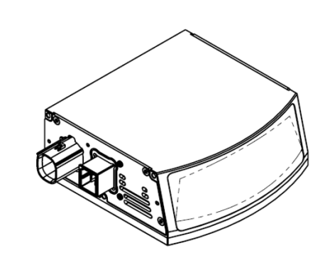

# Comparison between Livox Horizon and Robosense

### **PointCloud in Rviz**

<ins>Livox Horizon</ins>

We can see in this view the scanning pattern of the lidAR

<ins>Robosense</ins>

**Comparison Table**

Lidar        | Price (USD)  | PointCloud Quality | Robustness in OffRoad | Size | FoV | Connection
| ----| ------ | ----- | ----- | ----- | ----- | -----|
| Livox Horizon| 800 | **Dual Return Mode :** 480000 points per second. **Scanning Density:** Center Spacing 0.2° , Circular Areas Spacing 0.4°  | Has a fan on the bottom but its removable as long as an alternative cooling method is provided. The lidar itself is Ip67 so it may be a matter of only cleaning the dissipation module every now and then. Included cables do not meet the same standards of dust proof. Messages coming from Lidar provides a tag containing information of the confidence level of noise, may be useful to filter out dust clouds.|  115mm x 77mm x 84.1mm |  **H:** 81.7°  **V:** 25.1°| Ethernet
| Robosense  | 1898 | Data rate: 750,000 points/sec (single return)  1,500,000 points/sec (dual return)  Angular Resolution: 0.2°| **Protection Level:** IP67.  Forced convection is required for long hours of work. In our the model the case has no fins for ventilation. Reaches very high temperature in an indoor environment. |  110mm x 108mm x 45mm | **H:** 120° **V:** 25° | Ethernet |

**Extra**

The RS-Lidar_M1 we have now is the revision B2. The new B3 has holes for ventilation in the outer case and is compatible with the new ROS Driver that still has support. I have contacted Robosense technical support for more information.
