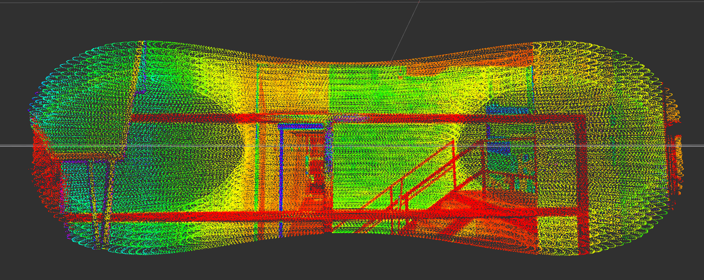
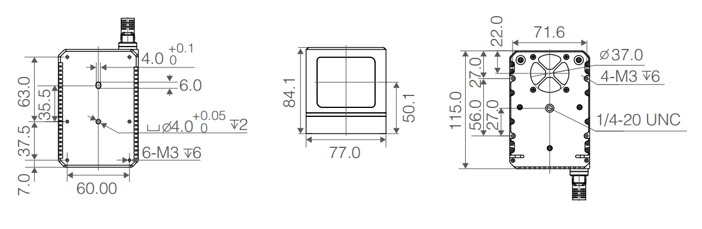
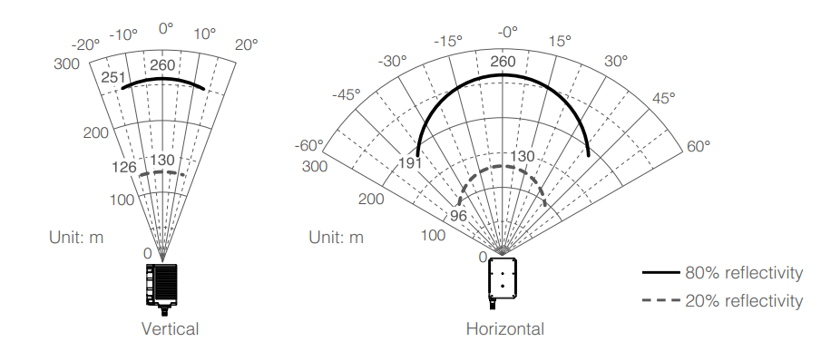

# Comparison between Livox Horizon and Robosense

### **PointCloud in Rviz**

Livox Horizon

Robosense

Comparison Table

Lidar        | Price (USD)  | PointCloud Quality | Robustness in OffRoad | Size | FoV
| ----| ------ | ----- | ----- | ----- | ----- |
| Livox Horizon| 800 | - | Has a fan on the botton but its removable provided an alternative cooling method |  |  

| Robosense  | Connect to Livox Hub device Publish pointcloud2 format data Autoload rviz |

